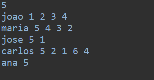
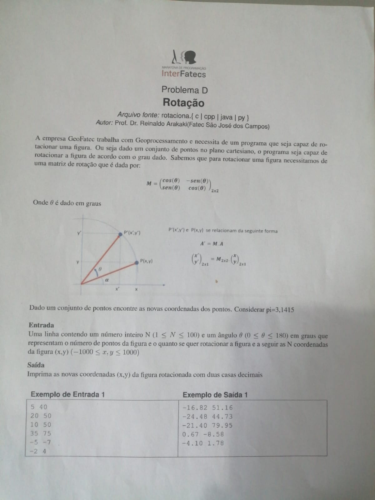

#### Problema C
## Calcetis

 Embalado por um movimento crescente de investimento em startups orientais, o neto de Munarinho, Tikomo Nakama, decidiu abrir uma startup. Calcetis com a ideia de vender calcinhas usadas por musas de cinema. televisão e redes sociais.

Ele está em uma etapa importante do desenvolvimento em que precisa sugerir novos produtos aos compradores que já tem produtos no carrinho de compras. A idéia é que o valor do carrinho some R$200,00, para que o comprador tenha a opção de não pagar o frete. Por uma questão de simbologia oriental, que trará sorte para a startup, Nakama deseja ofertar exatamente 3 produtos diferentes que somem, juntos aos produtos do carrinho, exatamente o valor necessário, caso seja possivel. 

### Exemplo de entrada

### exemplo de saida

(Podendo conter duas saidas possiveis)

### Problema G 
## Plantão de dúvidas

<h3>Tipo de entrada</h3>

## Matriz de rotação

<h3>Tipo de Saida</h3>

